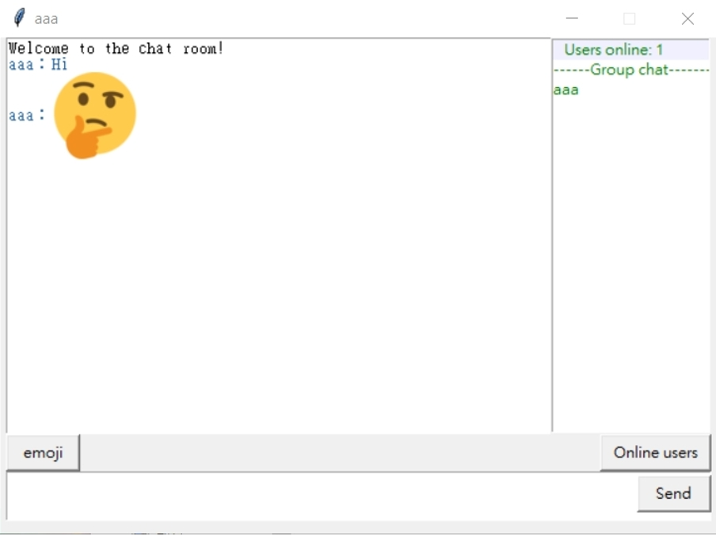
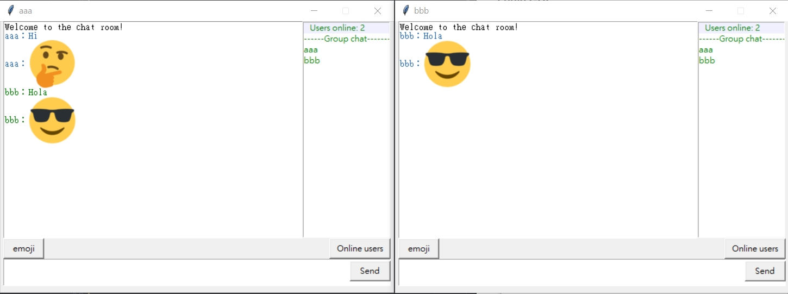
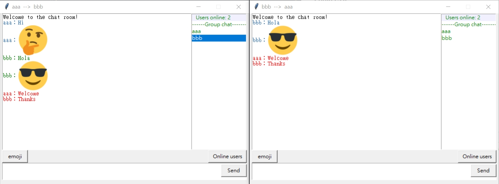

# python-chatroom
A Python TCP chatroom by Tkinter

Final project of [NETWORK MANAGEMENT 2021](http://class-qry.acad.ncku.edu.tw/syllabus/online_display.php?syear=0109&sem=2&co_no=R750600&class_code=)

## Usage

Activate chat server
```
python server.py
```

Activate chat client
```
python client.py
```


## Screenshots
### Login GUI, Input any Username you want


### Chatroom GUI, support emoji


### Multi-client chat



### Private chat



